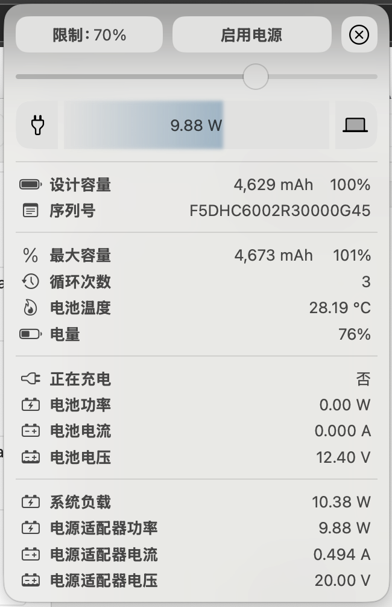
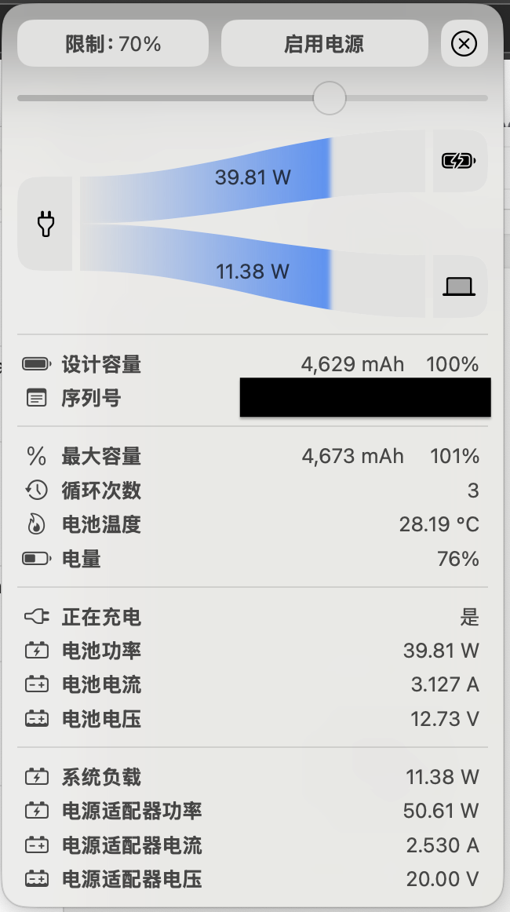
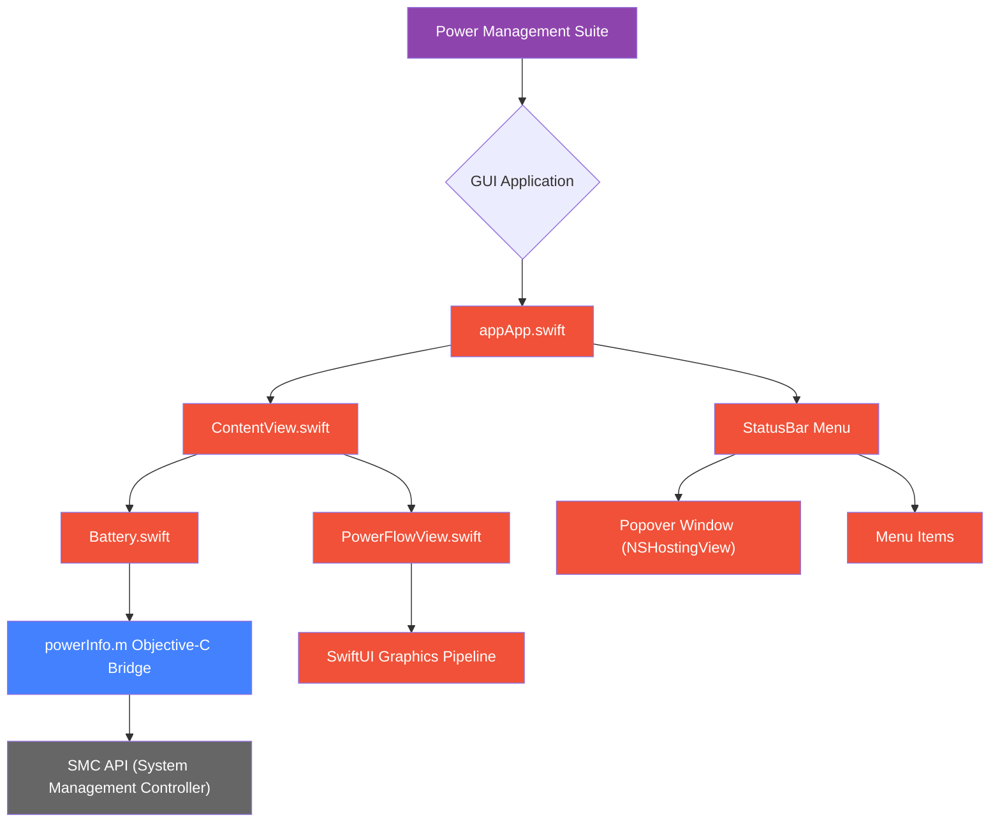

# Power Management Suite

[]()
[](https://www.gnu.org/licenses/gpl-3.0)

A comprehensive power monitoring solution for macOS featuring:

- 🖥 GUI application with real-time power flow visualization
- 🔋 Detailed battery health analytics
- ⚡️ CLI tools for low-level power monitoring
- 📊 System load statistics collection

- Initial app icon (This icon is open to creative reinterpretation by anyone.)

  

## Architecture Overview



## Features

### GUI Application
- Real-time power flow visualization
- Battery health monitoring (cycles, capacity, temperature)
- Adapter power input tracking
- System load/power consumption correlation

## Requirements

- macOS 13 Ventura or newer
- Xcode 15+
- Administrative privileges for SMC access

##  Installation

DMG image can be download in Releases, after drag it into your application folder, it is expected to work by simply clicking the icon.

1. **GateKeeper Configuration**
   If you encounter security warnings when running the application:
   - Go to `System Settings` → `Privacy & Security` → scroll down to `Security`
   - Click "Open Anyway" next to the BattGUI warning
   - Confirm execution in the dialog

2. **Advanced Configuration (Admin required)**
   For system-level monitoring access:
```bash
# Temporarily disable GateKeeper (resets after reboot)
sudo spctl --master-disable
```
## Usage

GUI Application:
```bash
open app/build/Release/app.app
```


## Known Issues

- **Adapter Voltage Detection**: Current implementation fixes adapter voltage at 20.00V due to missing SMC key in [VirtualSMC documentation](https://github.com/acidanthera/VirtualSMC/blob/master/Docs/SMCKeys.txt). Amperage is calculated using I = P / U. Contributions welcome to identify the correct SMC key.

- **UI/UX Optimization**: Ongoing improvements to power management workflows including:
  - Enhanced real-time measurement visualization
  - Historical data trending
  - Customizable power profiles

## Contributing
See [CONTRIBUTING.md](CONTRIBUTING.md) for development setup and guidelines.

## License
GPLv3 (see [LICENSE](LICENSE))