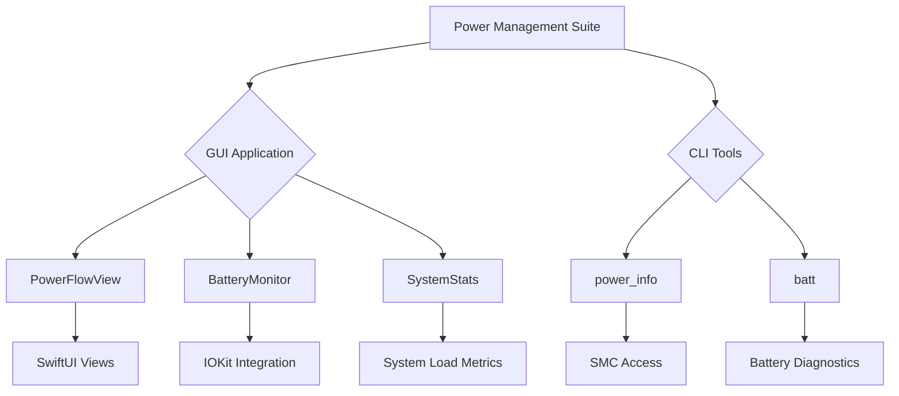

# Power Management Suite

[]()
[](https://www.gnu.org/licenses/gpl-3.0)

A comprehensive power monitoring solution for macOS featuring:

- 🖥 GUI application with real-time power flow visualization
- 🔋 Detailed battery health analytics
- ⚡️ CLI tools for low-level power monitoring
- 📊 System load statistics collection


## Architecture Overview



## Features

### GUI Application
- Real-time power flow visualization
- Battery health monitoring (cycles, capacity, temperature)
- Adapter power input tracking
- System load/power consumption correlation

### CLI Tools
- `power_info`: Low-level SMC access for power metrics
- `batt`: Advanced battery diagnostics (from [charlie0129/batt](https://github.com/charlie0129/batt))

## Requirements

- macOS 13 Ventura or newer
- Xcode 15+
- Administrative privileges for SMC access

## Installation

```bash
# Clone repository
git clone https://github.com/yourusername/power-suite.git
cd power-suite

# Build GUI application
xcodebuild -workspace app.xcodeproj/project.xcworkspace -scheme app

# Build CLI tools
cd systemLoad_Claude
make
```

## Usage

GUI Application:
```bash
open app/build/Release/app.app
```

CLI Monitoring:
```bash
# System power stats
./systemLoad_Claude/power_info -c

# Battery health check
./utility/batt health
```

## Contributing
See [CONTRIBUTING.md](CONTRIBUTING.md) for development setup and guidelines.

## License
GPLv3 (see [LICENSE](LICENSE))