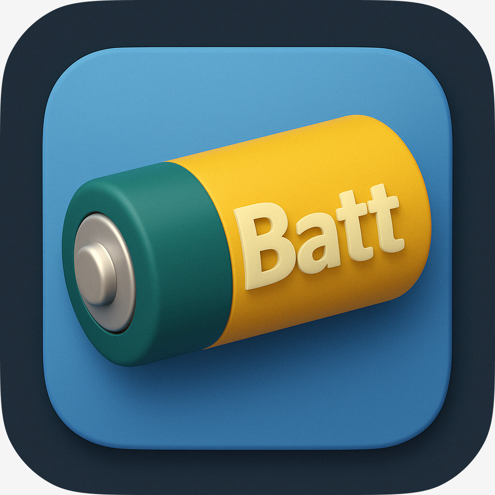
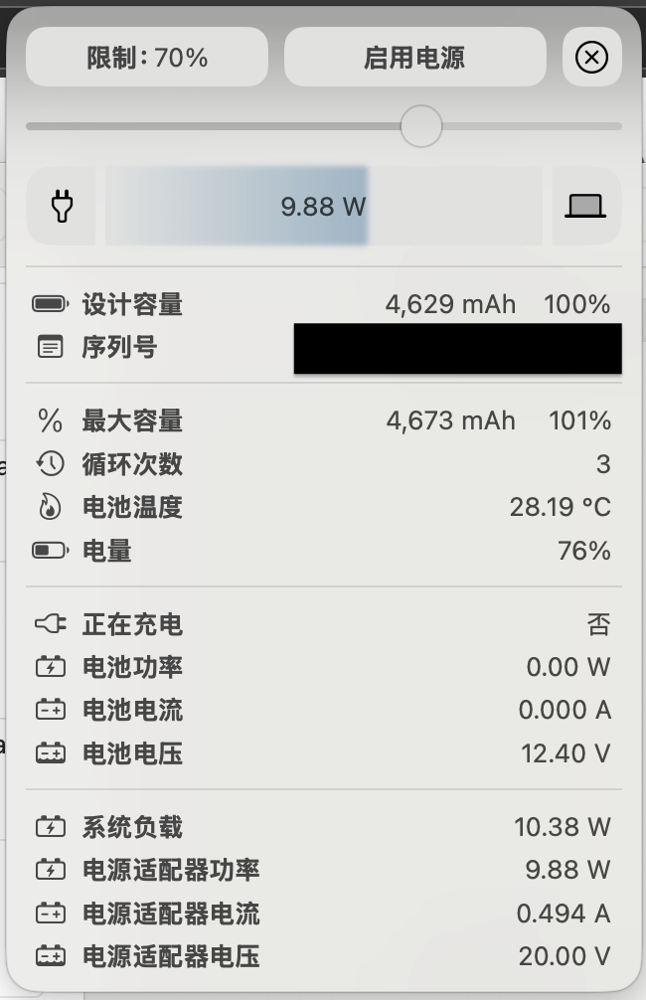
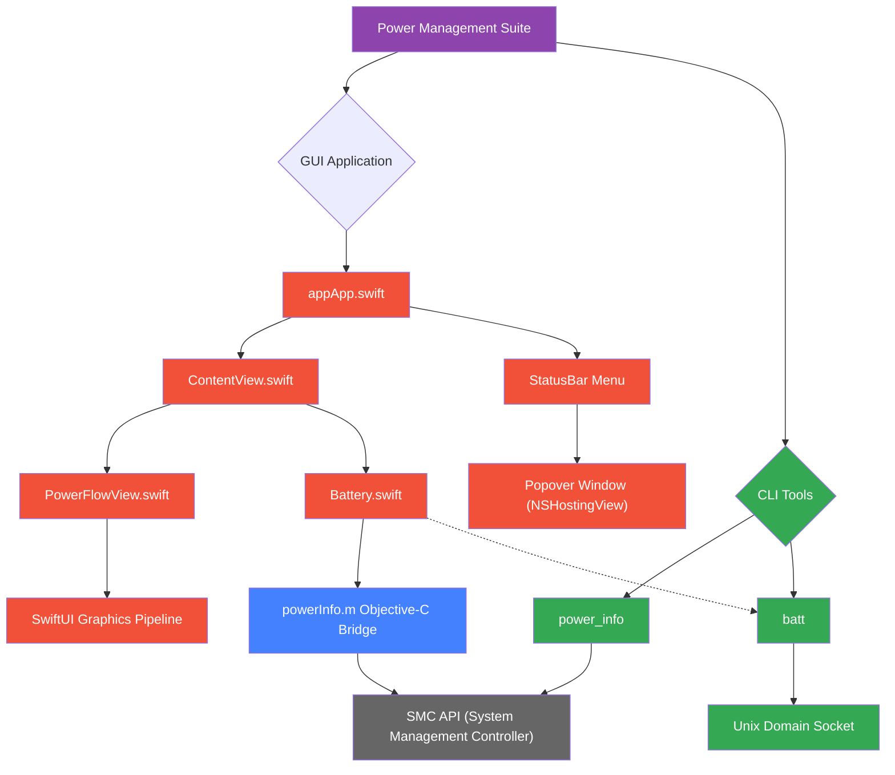

# Power Management Suite

[]()
[](https://www.gnu.org/licenses/gpl-3.0)

A comprehensive power monitoring solution for macOS featuring:

- 🖥 GUI application with real-time power flow visualization
- 🔋 Detailed battery health analytics
- ⚡️ CLI tools for low-level power monitoring
- 📊 System load statistics collection

- Initial app icon (This icon is open to creative reinterpretation by anyone.)

  

## Architecture Overview



### Manual installation steps
1. **GateKeeper Warning Handling**
    - **Warning Message**: If you have GateKeeper turned on, you might encounter messages like "batt is can't be opened because it was not downloaded from the App Store" or "batt cannot be opened because the developer cannot be verified". If you don't see this warning, you can skip this step.
    - **Solutions**:
        - **Recommended**: Go to `System Settings` -> `Privacy & Security` --scroll-down--> `Security` -> `Open Anyway`.
        - **Alternative**: Run `sudo spctl --master-disable` to disable GateKeeper entirely.


## Features

### GUI Application
- Real-time power flow visualization
- Battery health monitoring (cycles, capacity, temperature)
- Adapter power input tracking
- System load/power consumption correlation

### CLI Tools
- `power_info`: Low-level SMC access for power metrics
- `batt`: Advanced battery diagnostics (from [charlie0129/batt](https://github.com/charlie0129/batt))

- `power_info` cli call is replaced by directly invoke in Battery.swift and powerInfo.m
- `batt` cli call is replaced by Unix Domain Socket IPC method via Curl

## Requirements

- macOS 13 Ventura or newer
- Xcode 15+
- Administrative privileges for SMC access

## Installation

```bash
# Clone repository
git clone https://github.com/yourusername/power-suite.git
cd power-suite

# Build GUI application
xcodebuild -workspace app.xcodeproj/project.xcworkspace -scheme app

# Build CLI tools
cd systemLoad_Claude
make
```

## Usage

GUI Application:
```bash
open app/build/Release/app.app
```

CLI Monitoring:
```bash
# System power stats
./systemLoad_Claude/power_info -c

# Battery health check
./utility/batt health
```

## Known Issues

- **Adapter Voltage Detection**: Current implementation fixes adapter voltage at 20.00V due to missing SMC key in [VirtualSMC documentation](https://github.com/acidanthera/VirtualSMC/blob/master/Docs/SMCKeys.txt). Amperage is calculated using I = P / U. Contributions welcome to identify the correct SMC key.

- **GUI Prototype Limitations**: The current batt GUI (modeled after Aldente Pro) is an early-stage prototype requiring refinement. Specific challenges include:
  - Real-time voltage measurement accuracy
  - Power adapter data validation
  - UI/UX optimization for power management workflows

- **Command+Q not quitting when popover is visible**: When the application is activated via the status bar icon and the popover window is displayed, the standard Command+Q shortcut does not quit the application. This is likely due to the popover being a non-activating panel, preventing the application from becoming the key application to handle the shortcut. An attempt to fix this using a global event monitor was unsuccessful. Further investigation and alternative solutions are needed.

## Contributing
See [CONTRIBUTING.md](CONTRIBUTING.md) for development setup and guidelines.

## License
GPLv3 (see [LICENSE](LICENSE))